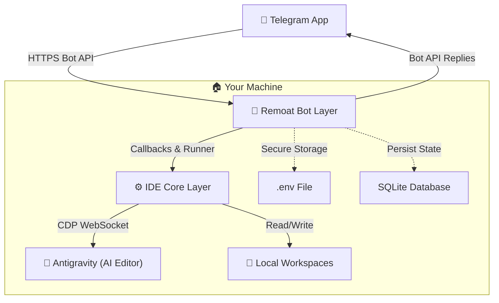

# Architecture & Core Design

## 1. System Overview
Remoat runs entirely on the user's local PC with no external server. It communicates with Telegram's Bot API over HTTPS and controls Antigravity via CDP (Chrome DevTools Protocol).



---

## 2. Ports & Adapters (Hexagonal Architecture)

To allow swapping Telegram for other messaging platforms (e.g. VK, Discord, or webhooks) in the future, the codebase strictly decouples the platform-agnostic Core Layer from platform-specific delivery using the **Ports & Adapters** pattern:

### A. Messenger Port (Core Abstraction)
*   **Purpose**: Defines a platform-independent abstraction interface for communication delivery.
*   **Key Files**:
    *   [src/services/messengerPort.ts](file:///e:/Desktop/Remoat/src/services/messengerPort.ts) — Interface `IMessengerPort`, and types `AbstractButton` / `ChannelContext`.

### B. Messenger Adapters (Platform Specific)
*   **Purpose**: Concrete adapter classes implementing `IMessengerPort` for specific messaging services.
*   **Key Files**:
    *   [src/bot/telegramAdapter.ts](file:///e:/Desktop/Remoat/src/bot/telegramAdapter.ts) — `TelegramAdapter` implementing port methods, transforming abstract buttons (including 2D layouts) into Grammy `InlineKeyboard`.
    *   [src/bot/telegramTopicManager.ts](file:///e:/Desktop/Remoat/src/bot/telegramTopicManager.ts) — Handles Telegram-specific forum topic creation and topic naming.

### C. Bot / Routing Layer (Platform Specific)
*   **Purpose**: Handles message receiving, user authorization, UI formatting, interactive menus, and command parsing for Telegram.
*   **Key Files**:
    *   [src/bot/index.ts](file:///e:/Desktop/Remoat/src/bot/index.ts) — Telegram bot setup, adapter instantiation, and router bindings.
    *   [src/bot/commands.ts](file:///e:/Desktop/Remoat/src/bot/commands.ts) — Command handlers (e.g. `/history`, `/workspace`).
    *   [src/bot/callbacks.ts](file:///e:/Desktop/Remoat/src/bot/callbacks.ts) — Inline keyboard button press routing.
    *   [src/bot/messageHandlers.ts](file:///e:/Desktop/Remoat/src/bot/messageHandlers.ts) — Message triggers routing.

### D. IDE Core Layer (Platform Agnostic)
*   **Purpose**: Manages low-level browser automation, active window detection, session scraper scripts, and CDP protocol command evaluations. It only references `IMessengerPort` and `ChannelContext` for communications.
*   **Key Files**:
    *   [src/services/idePromptRunner.ts](file:///e:/Desktop/Remoat/src/services/idePromptRunner.ts) — Controls prompting, response monitoring, thinking blocks parsing, and image scraping.
    *   [src/services/quickPickResolver.ts](file:///e:/Desktop/Remoat/src/services/quickPickResolver.ts) — Resolves Monaco/VS Code window selection QuickPick dropdowns.
    *   [src/services/cdpService.ts](file:///e:/Desktop/Remoat/src/services/cdpService.ts) — Base WebSocket CDP transport layer.
    *   [src/services/responseMonitor.ts](file:///e:/Desktop/Remoat/src/services/responseMonitor.ts) — The active response scraper loop.

---

## 3. Communication via Callbacks

The Bot Layer invokes the IDE Core Layer via `IdePromptRunner` and provides a set of typed callback hooks defined in `IdePromptCallbacks`:

```typescript
export interface IdePromptCallbacks {
    onActivityProgress?: (data: {
        title: string;
        body: string;
        footer: string;
        isFinalized: boolean;
    }) => Promise<void>;
    onLiveResponseUpdate?: (data: {
        title: string;
        body: string;
        footer: string;
        isAlreadyHtml: boolean;
        isFinalized: boolean;
    }) => Promise<void>;
    onComplete?: (data: {
        finalText: string;
        isHtml: boolean;
        choices: string[];
        elapsedSeconds: number;
        generatedImages: ExtractedResponseImage[];
    }) => Promise<void>;
    onQuotaReached?: (data: {
        elapsedSeconds: number;
        modelLabel: string;
        progressBody: string;
    }) => Promise<void>;
    onTimeout?: (data: {
        elapsedSeconds: number;
        payloadText: string;
        isHtml: boolean;
    }) => Promise<void>;
    onError?: (errorMsg: string) => Promise<void>;
}
```

This ensures that the IDE automation logic never depends on Grammy, the Telegram bot instance, or specific Telegram types.

### Interaction via Messenger Port
For asynchronous background events (such as detected approvals, errors, or planning updates), the Core Layer (via `CdpBridge`) invokes the injected `IMessengerPort` service. Since this service is configured at runtime (e.g. using `TelegramAdapter`), the Core Layer remains completely decoupled from target delivery schemas.

---

## 4. Context Preservation & Deduplication

Instructions and results are linked through Telegram's reply chain and SQLite state.

*   **Metadata in SQLite:** Message IDs and workspace context are stored in SQLite, allowing reply-based follow-up to restore the full project context.
*   **Reply-based continuation:** When a user replies to a bot message, Remoat loads the associated workspace/session context and forwards the follow-up to Antigravity.
*   **Seen Messages Deduplication (`seen_user_messages`):** Keeps track of processed user messages by their hash in SQLite. If the bot restarts or connection drops, this prevents re-sending or losing messages sent in the interim.
*   **Approval Message Deduplication (`active_approvals`):** Tracks active "Approval Required" prompts sent to Telegram. This prevents duplicating inline approval buttons on bot restart and keeps the original Telegram message ID to correctly edit/resolve it when approved.

---

## 5. GUI Action Detectors & Auto-Approval

The Core Layer schedules lightweight polling loops (detectors) to find specific states in the Antigravity UI:
1.  **ApprovalDetector**: Finds permission prompts (file write, command run) and propagates buttons back to the Bot Layer.
2.  **PlanningDetector**: Scrapes implementation plans (Action, Reference) and walkthrough summaries from the IDE's custom cards.
3.  **ErrorPopupDetector**: Identifies critical crash alerts ("Agent terminated due to error").

> [!TIP]
> All detectors are paused during active response generation to prevent performance overhead.

---

## 6. CLI Spawning & Resource Control

*   **CLI Spawn:** Antigravity is launched as an independent background process via `child_process.spawn`.
*   **Default IDE Launch:** On bot startup, if no CDP ports are responding (IDE is not running), the bot automatically spawns a default empty instance of Antigravity on port `9223` in the background.
*   **Controlled Reconnection:** During reconnection attempts, auto-launching of workspaces is disabled (`allowLaunch: false`) to avoid opening folder windows without explicit user consent.
*   **Task Queue:** Concurrent task queues (`createSerialTaskQueue`) process activities and response updates sequentially, avoiding collision.
