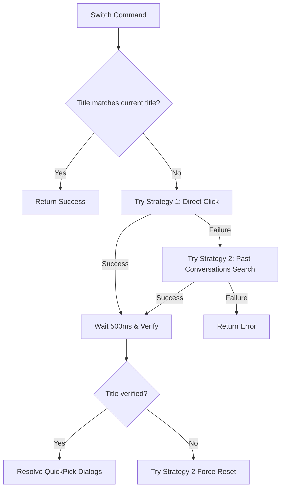

# Chat Sessions Integration & Automation Guide

This guide details how Remoat lists, creates, and switches conversation sessions inside the Antigravity IDE (Windsurf/Cascade panel) using the Chrome DevTools Protocol (CDP).

---

## 1. CDP Event Dispatch Strategy

Antigravity’s sidebar is built using Electron and React. Normal DOM events (such as `element.click()` or `element.dispatchEvent(new Event('input'))`) are ignored or blocked by React event boundaries.

**Rule for Replicating Actions:**
- **DO NOT** use DOM `.click()` blindly.
- **DO** query elements to get their bounding client rect (`getBoundingClientRect()`).
- **DO** calculate the center coordinates (`x`, `y`).
- **DO** dispatch physical click events via CDP `Input.dispatchMouseEvent` at those coordinates:

```typescript
// Click Simulation Template
await cdp.call('Input.dispatchMouseEvent', { type: 'mouseMoved', x, y });
await cdp.call('Input.dispatchMouseEvent', { type: 'mousePressed', x, y, button: 'left', clickCount: 1 });
await cdp.call('Input.dispatchMouseEvent', { type: 'mouseReleased', x, y, button: 'left', clickCount: 1 });
```

---

## 2. Command Flow: Listing Sessions (`/chats`)

### Execution Path
1. **Telegram Command Trigger:** User sends `/chats`.
2. **Router:** [src/bot/index.ts](file:///e:/Desktop/Remoat/src/bot/index.ts) routes the update to the `/chats` handler -> resolves workspace -> calls `chatSessionService.listAllSessions(cdp)`.
3. **Execution Steps:**
   - **Step 2.1:** Call `cdpService.ensureSidebarOpen()`.
   - **Step 2.2:** Evaluate `FIND_PAST_CONVERSATIONS_BUTTON_SCRIPT` (in [src/services/chatSessionService.ts](file:///e:/Desktop/Remoat/src/services/chatSessionService.ts)) to scan for:
     - `[data-past-conversations-toggle]`
     - `[data-tooltip-id*="history"]` or `[data-tooltip-id*="past-conversations"]`
     - `svg.lucide-history`
   - **Step 2.3:** Simulates a CDP click at the returned coordinates to open the "Past Conversations" panel.
   - **Step 2.4:** Wait 500ms for panel animation.
   - **Step 2.5:** Evaluate `SCRAPE_PAST_CONVERSATIONS_SCRIPT` to extract rows (`div[class*="cursor-pointer"]`).
     - **Boundary Check:** Skip all rows below the "Other Conversations" section header (`boundaryTop = el.getBoundingClientRect().top`).
     - **Title Scrape:** Locate the text in `span.text-sm`, skipping timestamps.
     - **Active Check:** Row matching `/focusBackground/i` class is the active session.
   - **Step 2.6:** If fewer than 20 sessions are returned, find and click "Show N more..." via coordinates, wait 500ms, and re-scrape.
   - **Step 2.7:** Send CDP `Input.dispatchKeyEvent` for `Escape` to close the panel.
   - **Step 2.8:** Telegram Bot renders the list via `buildSessionPickerUI` ([src/ui/sessionPickerUi.ts](file:///e:/Desktop/Remoat/src/ui/sessionPickerUi.ts)).

---

## 3. Command Flow: Starting New Chat (`/new`)

### Execution Path
1. **Telegram Command Trigger:** User sends `/new`.
2. **Router:** [src/bot/index.ts](file:///e:/Desktop/Remoat/src/bot/index.ts) handles `/new` -> calls `chatSessionService.startNewChat(cdp)`.
3. **Execution Steps:**
   - **Step 3.1:** Call `cdpService.ensureSidebarOpen()`.
   - **Step 3.2:** Wait for Cascade contexts to be ready.
   - **Step 3.3:** Evaluate `GET_NEW_CHAT_BUTTON_SCRIPT` to query `[data-tooltip-id="new-conversation-tooltip"]`.
   - **Step 3.4:** Read CSS `cursor` style of the button:
     - **`cursor === 'not-allowed'`**: The current chat is already empty. **Stop flow** (success).
     - **`cursor === 'pointer'`**: Active button. **Proceed to Step 3.5**.
   - **Step 3.5:** Simulates CDP click at button coordinates.
   - **Step 3.6:** Wait 1500ms for DOM update.
   - **Step 3.7:** Verify `cursor` is now `not-allowed`.
   - **Step 3.8:** Update local database mapping to clear active session pointers.

---

## 4. Session Switching Flow

When a user selects a session title from the Telegram interface, Remoat executes `chatSessionService.activateSessionByTitle(cdp, title)`:



### Strategy 1: Direct Click Script
If the session is already rendered in the current panel list, Remoat evaluates the script generated by `buildActivateChatByTitleScript(title)`:
- Scans all visible `button`, `[role="button"]`, `a`, `li`, `div`, `span` nodes inside `.antigravity-agent-side-panel`.
- Matches against normalized target title (exact or loose substring).
- Finds the closest clickable ancestor (`closest('button, [role="button"], a, li')`).
- Calls `.click()`.

### Strategy 2: Past Conversations Search Script
If the session is not visible, Remoat evaluates the script generated by `buildActivateViaPastConversationsScript(title)`:
- Opens the Past Conversations panel (using same selectors as `/chats`).
- Searches for the search input element (`findSearchInput()`) by scanning placeholders matching `select a conversation`, `search conversation`, `search`.
- Focuses the input, sets its `value` to the target title, and dispatches React-compatible `input` and `change` events.
- Selects the matching search result row and simulates a click.

---

## 5. Resolving Monaco QuickPick Dialogs

When a session is switched, the IDE workbench may display a VS Code overlay dialog (e.g., asking "Select where to open the conversation" or "Select workspace"). This overlay blocks standard inputs and must be resolved immediately.

- **Overlay Detector:** Query for `.quick-input-widget, [class*="quick-input-widget"]` in the main execution context.
- **Type Classifications:**
  - **Window Dialog:** Placeholder or text matches `where to open` or `open the conversation`.
  - **Workspace Dialog:** Placeholder or text matches `workspace` or `select workspace`.
- **Resolution Scripts:**
  - **Window Dialog:** Iterate rows (`.monaco-list-row, [role="option"], [role="button"]`) to find text containing `current window` or `current workspace`, and dispatch CDP click at coordinates.
  - **Workspace Dialog:** Search rows for workspace names like `desktop` or `remoat`, or fall back to the row with `.focused` or `aria-selected="true"`.
