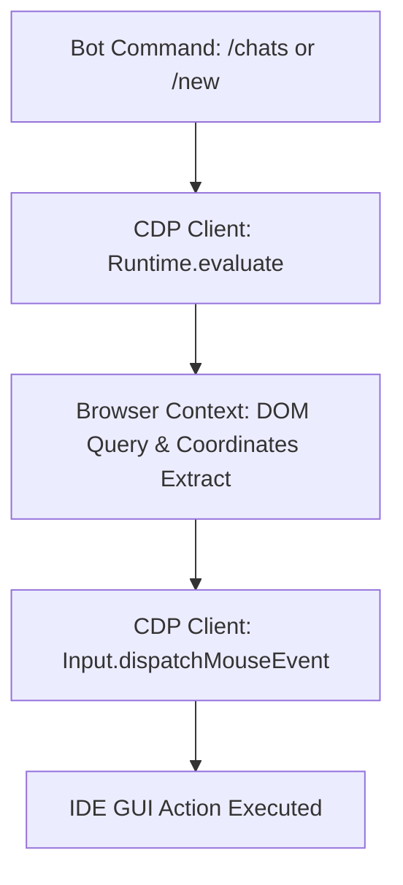
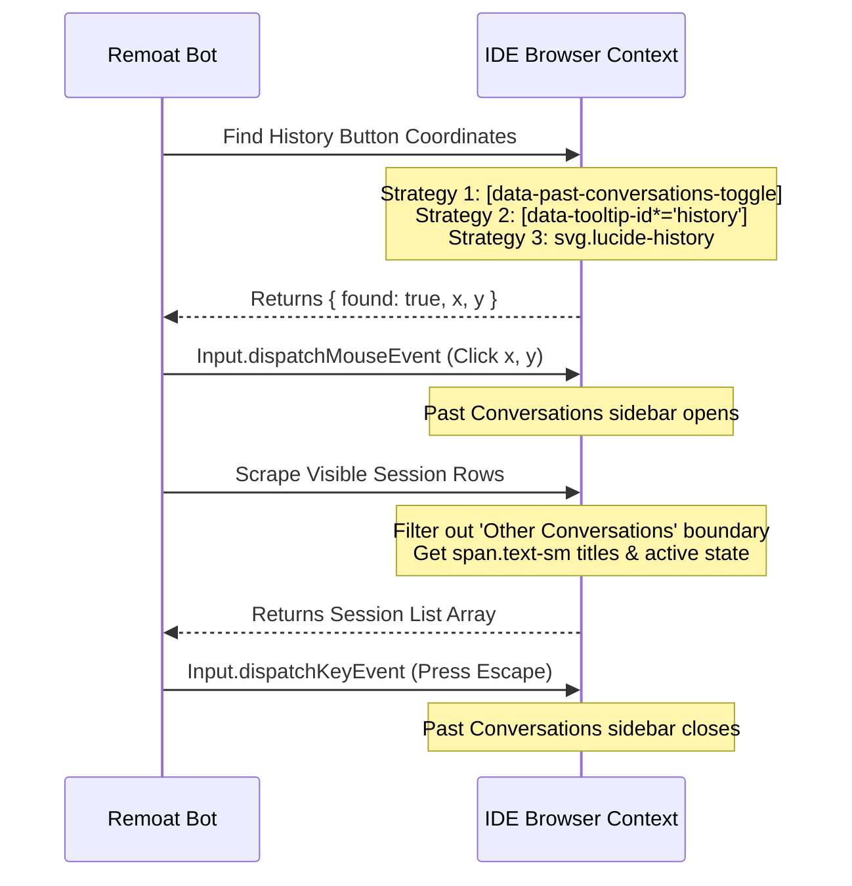

# Chat Sessions Management Guide (CDP Integration)

This document provides a comprehensive developer and AI agent guide on how Remoat lists, switches, and manages conversation sessions inside the Antigravity IDE (Windsurf/Cascade) over the Chrome DevTools Protocol (CDP).

It contains exact DOM selectors, browser scripts, and click strategies needed to replicate this functionality in another extension or automation bot.

---

## 1. Architecture Overview

Antigravity IDE runs a Chromium-based Electron runtime. Since extensions or external tools cannot directly access the private internal React state of the Cascade panel, Remoat uses **Chrome DevTools Protocol (CDP)** to inject and run JavaScript directly inside the browser context of the Cascade sidebar.

### Three-Step Action Pipeline



1. **Query & Evaluate:** The bot sends a script using `Runtime.evaluate` to scan the DOM and find the coordinates (`x`, `y`) of target elements.
2. **CDP Click Simulation:** Instead of calling `.click()` in the DOM (which is often ignored by React/Electron event boundaries), the bot dispatches physical mouse events via `Input.dispatchMouseEvent`.
3. **QuickPick Resolution:** When a session is selected, VS Code displays a QuickPick menu overlay. The bot detects it in the main window context and clicks the desired option.

---

## 2. Locate and Connect to the IDE

Before sending commands, you must establish a CDP WebSocket connection.

1. **Scanned Ports:** Remoat scans ports `[61390, 61114, 61113, 9222, 9223, 9333, 9444, 9555, 9666]` by requesting `http://127.0.0.1:${port}/json/list`.
2. **Identify Target:** It looks for a page where:
   - `type === "page"`
   - `webSocketDebuggerUrl` is present.
   - `url` contains `/workbench` or the title contains `"Antigravity"` or `"Cascade"`.
3. **Active Context:** Once connected, it calls `Runtime.enable` and tracks active execution contexts. The primary execution context ID is retrieved by searching for the context with name containing `"Extension"` or URL containing `"cascade-panel"`.

---

## 3. Session Listing (`/chats` command)

To get a list of recent sessions, the bot must programmatically open the **Past Conversations** sidebar panel, scrape the contents, and then close the panel.



### Browser Script: Find History Button
This script scans the DOM for the "History" or "Past Conversations" toggle button and returns its center coordinates:

```javascript
(() => {
    const isVisible = (el) => { 
        if (!el) return false; 
        const rect = el.getBoundingClientRect(); 
        if (rect.width === 0 || rect.height === 0) return false; 
        const style = window.getComputedStyle(el); 
        return style.display !== 'none' && style.visibility !== 'hidden'; 
    };
    const getRect = (el) => {
        const rect = el.getBoundingClientRect();
        return { found: true, x: Math.round(rect.x + rect.width / 2), y: Math.round(rect.y + rect.height / 2) };
    };

    // Strategy 1 (primary): data-past-conversations-toggle attribute
    const toggle = document.querySelector('[data-past-conversations-toggle]');
    if (toggle && isVisible(toggle)) return getRect(toggle);

    // Strategy 2: data-tooltip-id containing "history"
    const tooltipEls = Array.from(document.querySelectorAll('[data-tooltip-id]'));
    for (const el of tooltipEls) {
        if (!isVisible(el)) continue;
        const tid = (el.getAttribute('data-tooltip-id') || '').toLowerCase();
        if (tid.includes('history') || tid.includes('past-conversations')) {
            return getRect(el);
        }
    }

    // Strategy 3: SVG with lucide-history class
    const icons = Array.from(document.querySelectorAll('svg.lucide-history, svg[class*="lucide-history"]'));
    for (const icon of icons) {
        const parent = icon.closest('a, button, [role="button"], div[class*="cursor-pointer"]');
        const target = parent instanceof HTMLElement && isVisible(parent) ? parent : icon;
        if (isVisible(target)) return getRect(target);
    }

    return { found: false, x: 0, y: 0 };
})()
```

### Browser Script: Scrape Visible Sessions
Once the panel is open, the bot runs this script to extract session titles:

```javascript
(() => {
    const isVisible = (el) => { if (!el) return false; const rect = el.getBoundingClientRect(); if (rect.width === 0 || rect.height === 0) return false; const style = window.getComputedStyle(el); return style.display !== 'none' && style.visibility !== 'hidden'; };
    const normalize = (text) => (text || '').trim();

    const items = [];
    const seen = new Set();

    // Find the scrollable list container
    const containers = Array.from(document.querySelectorAll('div[class*="overflow-auto"], div[class*="overflow-y-scroll"]'));
    const container = document.getElementById('fastpick-listbox') ||
        document.querySelector('div[class*="jetski-fast-pick"] div[class*="overflow"]') ||
        containers.find((c) => isVisible(c) && c.querySelectorAll('div[class*="cursor-pointer"]').length > 0) ||
        document;

    // Boundary check: skip other-project conversations
    let boundaryTop = Infinity;
    const headerCandidates = container.querySelectorAll('div[class*="text-xs"][class*="opacity"]');
    for (const el of headerCandidates) {
        if (!isVisible(el)) continue;
        const t = normalize(el.textContent || '');
        if (/^Other\s+Conversations?$/i.test(t)) {
            boundaryTop = el.getBoundingClientRect().top;
            break;
        }
    }

    // Scrape session rows
    const rows = Array.from(container.querySelectorAll('div[class*="cursor-pointer"]'));
    for (const row of rows) {
        if (!isVisible(row)) continue;
        if (row.getBoundingClientRect().top >= boundaryTop) continue; // Skip other-project items
        
        const spans = Array.from(row.querySelectorAll('span.text-sm span, span.text-sm'));
        let title = '';
        for (const span of spans) {
            const t = normalize(span.textContent || '');
            if (/^\d+\s+(min|hr|hour|day|sec|week|month|year)s?\s+ago$/i.test(t)) continue; // skip timestamp
            if (t.length < 2 || t.length > 200) continue;
            title = t;
            break;
        }
        if (!title || seen.has(title)) continue;
        seen.add(title);
        
        const isActive = /focusBackground/i.test(row.className || '');
        items.push({ title, isActive });
    }
    return { sessions: items };
})()
```

---

## 4. Session Activation / Switching

To switch to a different conversation, the bot uses two strategies:

### Strategy 1: Direct Side-Panel Link Click
If the target conversation is already visible in the side panel:

```javascript
(async () => {
    const wanted = "Target Conversation Title".toLowerCase().trim();
    const panel = document.querySelector('.antigravity-agent-side-panel') || document;
    const isVisible = (el) => { if (!el) return false; const rect = el.getBoundingClientRect(); return rect.width > 0 && rect.height > 0; };
    
    const nodes = Array.from(panel.querySelectorAll('button, [role="button"], a, li, div, span')).filter(isVisible);
    const target = nodes.find(n => (n.textContent || '').toLowerCase().trim() === wanted);
    if (target) {
        const clickable = target.closest('button, [role="button"], a, li') || target;
        clickable.click();
        return { ok: true };
    }
    return { ok: false, error: 'Not found in direct sidebar' };
})()
```

### Strategy 2: Past Conversations Search & Select
If the conversation is not visible, the bot:
1. Opens the **Past Conversations** sidebar.
2. Finds the search input field (`findSearchInput()` searches for placeholders matching `search`, `select a conversation`).
3. Focuses and types the target conversation title.
4. Clicks the filtered option inside the popup.

---

## 5. Resolving VS Code QuickPick Dropdowns

When selecting a chat, the IDE runtime may trigger a VS Code native overlay asking **"Select where to open the conversation"** or **"Select workspace"**. This overlay blocks GUI actions and must be resolved automatically.

```html
<!-- Widget Selector -->
.quick-input-widget
```

### QuickPick Resolution Script
This script detects the open QuickPick widget, analyzes the options, and returns the coordinates for clicking the appropriate choice:

```javascript
(() => {
    const isVisible = (el) => {
        if (!el || !(el instanceof HTMLElement)) return false;
        const style = window.getComputedStyle(el);
        if (style.display === 'none' || style.visibility === 'hidden' || parseFloat(style.opacity || '1') === 0) return false;
        const rect = el.getBoundingClientRect();
        return rect.width > 0 && rect.height > 0;
    };
    
    const widgets = Array.from(document.querySelectorAll('.quick-input-widget, [class*="quick-input-widget"]'));
    const visibleWidget = widgets.find(isVisible);
    if (!visibleWidget) return { found: false };
    
    const inputEl = visibleWidget.querySelector('.quick-input-filter input');
    const placeholder = ((inputEl ? inputEl.getAttribute('placeholder') : '') || '').toLowerCase();
    const widgetText = (visibleWidget.textContent || '').toLowerCase();
    
    const isWindowDialog = placeholder.includes('where to open') || placeholder.includes('open the conversation') || widgetText.includes('where to open');
    const isWorkspaceDialog = placeholder.includes('workspace') || placeholder.includes('select workspace') || widgetText.includes('select workspace') || widgetText.includes('workspace to open');
    
    if (!isWindowDialog && !isWorkspaceDialog) {
        return { found: true, type: 'unknown' };
    }
    
    const rows = Array.from(visibleWidget.querySelectorAll('.monaco-list-row, [role="option"], [role="button"]'));
    const visibleRows = rows.filter(isVisible);
    
    // 1. If asking "where to open", select "current window" or "current workspace"
    if (isWindowDialog) {
        for (const row of visibleRows) {
            const rowText = (row.textContent || '').toLowerCase();
            if (rowText.includes('current window') || rowText.includes('current workspace')) {
                const rect = row.getBoundingClientRect();
                return {
                    found: true,
                    type: 'window',
                    text: row.textContent.trim(),
                    x: Math.round(rect.left + rect.width / 2),
                    y: Math.round(rect.top + rect.height / 2)
                };
            }
        }
    }
    
    // 2. If asking for workspace, choose Desktop/Remoat or first focused option
    if (isWorkspaceDialog) {
        for (const row of visibleRows) {
            const rowText = (row.textContent || '').toLowerCase();
            if (rowText.includes('desktop') || rowText.includes('remoat')) {
                const rect = row.getBoundingClientRect();
                return {
                    found: true,
                    type: 'workspace',
                    text: row.textContent.trim(),
                    x: Math.round(rect.left + rect.width / 2),
                    y: Math.round(rect.top + rect.height / 2)
                };
            }
        }
        
        // Take focused row fallback
        for (const row of visibleRows) {
            if (row.classList.contains('focused') || row.getAttribute('aria-selected') === 'true') {
                const rect = row.getBoundingClientRect();
                return {
                    found: true,
                    type: 'workspace',
                    text: row.textContent.trim(),
                    x: Math.round(rect.left + rect.width / 2),
                    y: Math.round(rect.top + rect.height / 2)
                };
            }
        }
    }
    
    return { found: true, error: 'No clickable options found' };
})()
```

---

## 6. How to Replicate (For Extension Developers / Other Bots)

If you are writing a VS Code extension or another assistant bot and need to listing/managing dialogs:

1. **Don't use `document.querySelector('button').click()` blindly.** The sidebar uses shadow rendering or custom focus handlers. Always use absolute viewport coordinates for click dispatching:
   ```typescript
   // CDP Example
   await cdp.call('Input.dispatchMouseEvent', {
       type: 'mousePressed', x, y, button: 'left', clickCount: 1
   });
   await cdp.call('Input.dispatchMouseEvent', {
       type: 'mouseReleased', x, y, button: 'left', clickCount: 1
   });
   ```
2. **Handle QuickPicks.** Whenever your code clicks a session link, poll the DOM for `.quick-input-widget` for at least 3 seconds. If it appears, resolve it by clicking `current window`.
3. **Session boundary filtering.** When listing chats, always parse headers inside the scrollable container. If you see the text "Other Conversations", stop scraping, because everything below it belongs to different directories or workspaces.
